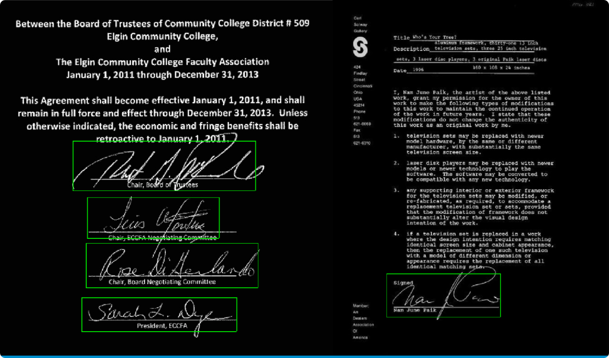

# SignVer: A library for Automatic Signature Verification

 

SignVer applies modern deep learning techniques to the task of signature verification - 
given a pair (or pairs of) signatures, determine if they are produced by the same user (genuine signatures) or different users (potential forgeries). SignVer addresses this task by providing a set of modules that address subtasks required to implement signature verification in real world environments.


## Signver Library Modules

### Localizer

Returns a list of bounding boxes where signatures are located in an image.

```python
from signver.localizer import Localizer
detections = localizer.detect(input_tensor)
```

